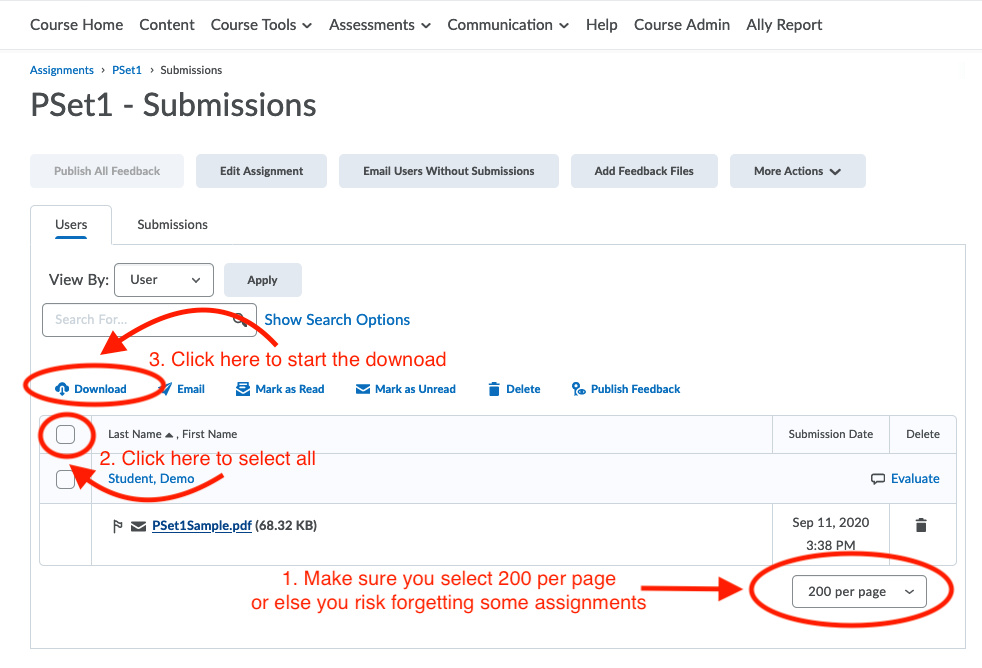
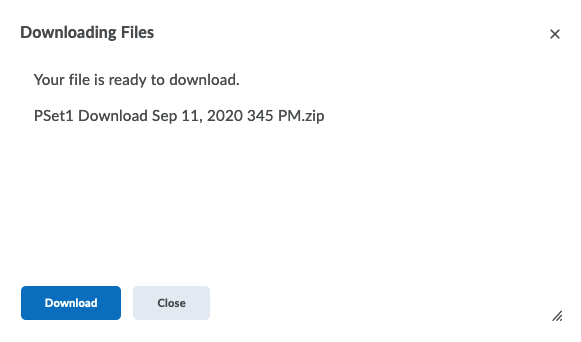
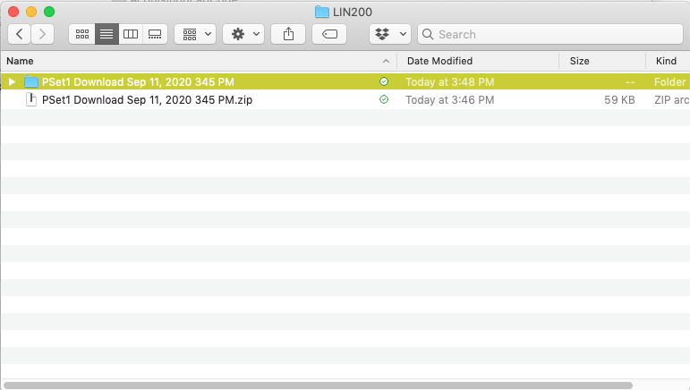
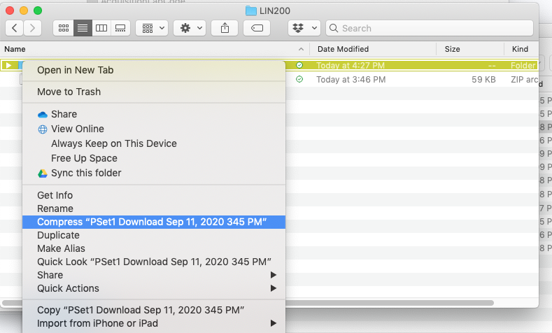
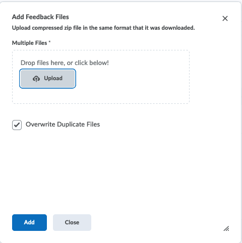
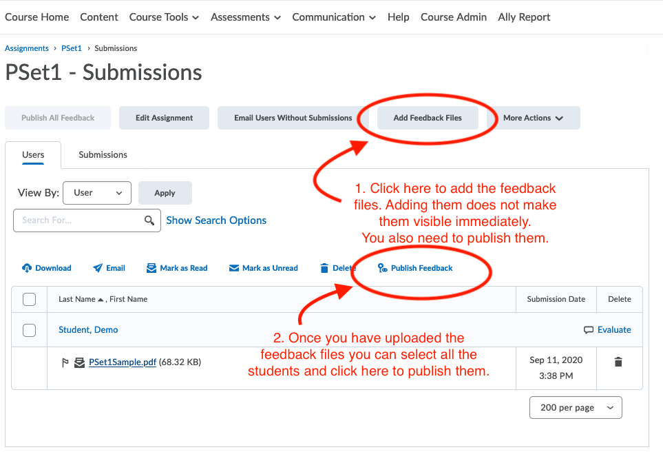

[//]: % !TEX TS-program = pandoc-pdf

---
title: Grading with an iPad and D2L

author: Alan Munn, Michigan State University

date: September, 2020
...

# How to grade on your iPad

These instructions are specific to D2L; other learning management systems may be different, although the basic idea is likely to be the same.

## On your computer (not your iPad)

The initial steps are best done on your computer, and not on the iPad directly.

1. Go to your assignment folder on D2L and first make sure that everyone has submitted PDF files and not Word files. If you have only a few Word submissions, it's probably easiest to convert them yourself, but if you have quite a few, then you should select those students and send them an email requesting a PDF file not a Word file.  I recommend you do this check very soon after the PSet is due, so that students have a bit of time to respond to your email.

1.  Once you're ready to download, follow the three steps shown below:

 - Choose "200 per page " to display all of the assignments
 - Click on the box that selects all of them
 - Click on the Download link

{ width=60% }\ 

2. The download link will create a zip file which you download on your computer.

{ width=40% }\ 

3. Save the `.zip` file on your computer. Since homeworks count as "Student Records" for FERPA purposes, you should save these on your MSU One Drive folder, *not* in Dropbox or iCloud.  If you haven't installed OneDrive on your computer, you should do so beforehand.

4. Once you've unzipped the files you will see a folder (this is a Mac view, but the PC should be similar)

{ width=60% }\ 

## On your iPad

This section assumes Notability and an iPad. If you are using another input method (graphics tablets), or another app for annotation, then you can skip this part. 

1. On your iPad, open Notability and import all of the PDF files that students have submitted, as shown below:

{ width=40% }\ 

2. Now grade each assignment as you normally would on paper.

3. When you are done grading them all, export them back to the same folder you downloaded them from.

{ width=40% }\ 

## Back on your computer

1. Now back on your computer, re-zip the folder containing the graded assignments (make sure the folder has synced correctly.)  On a Mac, you can do this by selecting the folder and choosing “Compress” from the File Menu (or Control-click/right-click). On Windows you may need a separate tool to do this.

{ width=40% }\ 

2. On D2L go back the the Assignments folder for that assignment.

3. Choose Add Feedback files

4. Now add the new `.zip` file of the graded assignments. You should see the following dialog box:

{ width=40% }\ 

5. Once you have uploaded the feedback files, you also need to Publish them, using the Publish Feedback link:

{ width=60% }\ 
